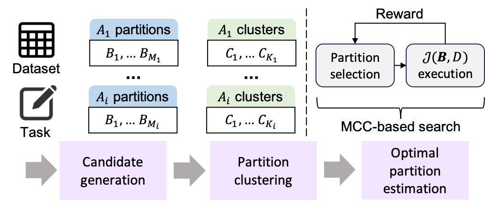

# Quill: Interpretable Attribute Discretization

Quill is a research codebase for **interpretable attribute discretization**—turning continuous attributes into human-meaningful bins while preserving downstream task utility. It provides baselines and evaluators for utility/semantics trade-offs, along with scripts and prompts to reproduce results.

> 🔎 Why this matters: good bins make models easier to explain, visualizations clearer, and causal/statistical analyses more robust—without giving up performance.


<p align="center">
  
  <br>
  <em>Figure 1: Quill overview.</em>
</p>

---

## Features

- 📊 **Utility–Semantics trade-off**: evaluate partitions for both task performance and human-meaningfulness.
- 🧪 **Quill evaluation**: Quill evaluator scripts (see `evaluate_MCC.py`, `evaluate_MCC_single.py`).
- 🧪 **Baseline implementation** baselines compared in our experiments (`./baselines`).
- 📁 **Organized repo layout**: data inputs, ground-truths, prompts, and scripts.
- 📜 **Technical report**: a PDF of the full version of the paper (`full_technical_report.pdf`).

---

## Repository Structure

```
quill/
├─ baselines/                # Baseline implementations
├─ data/                     # Benchmark datasets
├─ prompts/                  # LLM prompts used in experiments
├─ scripts/                  # End-to-end framework and helper scripts
├─ truth/                    # Benchmark ground-truth partitions
├─ evaluate_MCC.py           # MCC-based search (Quill) evaluator
├─ evaluate_MCC_single.py    # UCB-guided MCC variant (Quill) evaluator
├─ requirements.txt  # Python dependencies
└─ full_technical_report.pdf # Full version write-up
```

---
